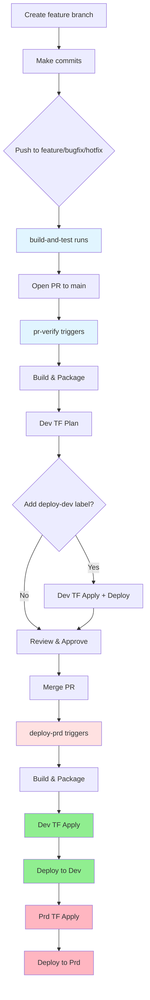

# Development Workflows

Target: Engineers working on twenty-one (Azure Static Web App). Covers branch strategy, CI/CD triggers, and typical development flows.

## Branch Strategy & Triggers

### Feature Development feature/*, bugfix/*, hotfix/*
- **build-and-test.yml**: Runs on push to feature/bugfix/hotfix branches
  - Installs Node 20.x, restores dependencies, runs `npm run build`
  - Uploads static site artifact for reuse
  - Purpose: fast feedback on WIP changes

### Pull Requests → main
- **pr-verify.yml**: Validation pipeline (runs on PR open, updates, reopen, ready for review, label changes)
  - Build and package static site
  - Terraform plan for dev by default (skips dependabot and drafts)
  - Terraform plan+apply and deploy to dev when labeled `deploy-dev`
  - Terraform plan for prd when labeled `run-prd-plan`
  - Concurrency groups prevent parallel dev/prd operations

### Main Branch on merge
- **deploy-prd.yml**: Promotion pipeline
  - Build → Dev plan/apply → Deploy Dev → Prd plan/apply → Deploy Prd
  - Triggers: push to `main`, weekly schedule (Thu 3am UTC), manual dispatch
  - Workflow-level concurrency enforced via env groups

### Scheduled & On-Demand
- **codequality.yml**: Weekly Monday 3am UTC + on PR/push to main
  - SonarCloud (JavaScript) + CodeQL (JavaScript/TypeScript)
- **deploy-dev.yml**: Manual dispatch
  - Build → Dev plan/apply → Deploy Dev
- **destroy-development.yml** / **destroy-environment.yml**: Manual destroys for dev or targeted environments

## Standard Developer Flow

### Local Development
```bash
# Standard validation sequence
cd src
npm install
npm run build
```

### Feature Branch → PR → Merge Flow



## Copilot & Label Flow

- Copilot branches follow the same rules; drafts and dependabot PRs skip Terraform by default
- Add `deploy-dev` to run dev plan/apply + deploy; add `run-prd-plan` to run the prd plan

## Pipeline Building Blocks

- **Terraform**: `terraform-plan`, `terraform-plan-and-apply`, `terraform-destroy` composites from `frasermolyneux/actions`
- **Deployment**: `Azure/static-web-apps-deploy@v1` with API key pulled via `az staticwebapp secrets list`
- **Quality**: SonarCloud + CodeQL (JavaScript/TypeScript)

## Quick Reference

| Scenario           | Workflow       | Trigger                  | Terraform     | Deploy  |
| ------------------ | -------------- | ------------------------ | ------------- | ------- |
| Feature commit     | build-and-test | Push to feature/bugfix   | ❌             | ❌       |
| PR validation      | pr-verify      | PR to main               | Dev plan      | Dev (label) |
| Merge to main      | deploy-prd     | Push to main             | Dev+Prd apply | Dev+Prd |
| Manual dev refresh | deploy-dev     | Manual dispatch          | Dev apply     | Dev     |
| Weekly maintenance | deploy-prd     | Thursday 3am UTC         | Dev+Prd apply | Dev+Prd |
| Code quality       | codequality    | Monday 3am UTC + PR/push | ❌             | ❌       |

## Environment Variables

OIDC authentication uses GitHub environment variables (not secrets):
- `AZURE_CLIENT_ID`: Service principal app ID
- `AZURE_TENANT_ID`: Azure AD tenant
- `AZURE_SUBSCRIPTION_ID`: Target subscription

Defined in **Development** and **Production** environments within GitHub repository settings.
